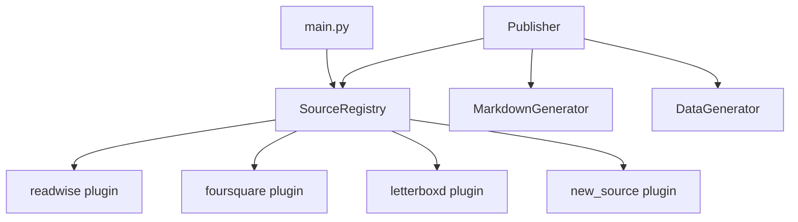

# Modular Architecture Brainstorm: Plugin-Based Source System

## Current State Analysis

The codebase has **4 data sources** (Readwise, Foursquare, Letterboxd, Overcast) that each follow the same internal pattern:

| File | Purpose |
|------|---------|
| `models.py` | SQL table definitions (data tables + analysis table) |
| `database.py` | SQLite CRUD operations |
| `sync.py` or `importer.py` | Data ingestion (API or file-based) |
| `analytics.py` | Monthly aggregation → writes to `analysis` table |

**Adding a new source today requires touching 6+ files:**

1. Create a new `src/<source>/` package (4 files)
2. Add config entries to [config.py](file:///Users/yulong/Documents%20(local)/coding/digital-footprint-dump/src/config.py)
3. Add CLI commands to [main.py](file:///Users/yulong/Documents%20(local)/coding/digital-footprint-dump/main.py) (sync, analyze, init, status blocks)
4. Add `_get_<source>_analysis()` method to [publisher.py](file:///Users/yulong/Documents%20(local)/coding/digital-footprint-dump/src/publish/publisher.py)
5. Add `_get_all_<source>()` method to [data_generator.py](file:///Users/yulong/Documents%20(local)/coding/digital-footprint-dump/src/publish/data_generator.py)
6. Add `_generate_<source>_section()` to [markdown_generator.py](file:///Users/yulong/Documents%20(local)/coding/digital-footprint-dump/src/publish/markdown_generator.py)

### The Schema Challenge

Every source has a **different analysis table schema**:

| Source | Analysis Columns |
|--------|-----------------|
| Readwise | `articles`, `words`, `reading_time_mins` |
| Foursquare | `checkins`, `unique_places` |
| Letterboxd | `movies_watched`, `avg_rating`, `min_rating`, `max_rating`, `avg_years_since_release` |
| Overcast | `feeds_added`, `feeds_removed`, `episodes_played` |

Common columns across all: `year_month` (PK), `year`, `month`, `updated_at`.

---

## Design Options

### Option A: Source Plugin Interface (Recommended)

Define an abstract base class that each source module implements. The framework discovers and orchestrates plugins — **no framework code changes needed** to add a new source.

```python
# src/base.py
class SourcePlugin(ABC):
    """Every source implements this interface."""
    
    name: str                  # "readwise", "letterboxd"
    display_name: str          # "Readwise", "Letterboxd"
    source_type: str           # "api" or "file"
    
    @abstractmethod
    def validate_config(self) -> bool: ...
    
    @abstractmethod
    def init_db(self) -> None: ...
    
    @abstractmethod
    def sync(self) -> dict: ...
    
    @abstractmethod
    def analyze(self) -> int: ...
    
    @abstractmethod
    def get_status(self) -> dict: ...
    
    @abstractmethod
    def get_analysis(self, year_month: str) -> Optional[dict]: ...
    
    @abstractmethod
    def get_all_analysis(self) -> List[dict]: ...
    
    # --- Publishing concerns ---
    @abstractmethod
    def get_analysis_metrics(self) -> list[str]: ...
    # e.g. ["articles", "words", "reading_time_mins"]
    
    @abstractmethod  
    def get_comparison_metrics(self) -> list[str]: ...
    # subset for MoM/YoY — e.g. ["articles", "words", "reading_time_mins"]
    
    @abstractmethod
    def format_markdown_section(self, data: dict, comparisons: dict) -> str: ...
    
    @abstractmethod
    def format_data_file_records(self, rows: List[dict]) -> List[dict]: ...
    # transforms analysis rows to Hugo-friendly dicts
    
    @property
    @abstractmethod
    def data_file_path(self) -> str: ...
    # e.g. "data/activity/reading.yaml"
```

**How it works:**



- **`SourceRegistry`** auto-discovers plugins (e.g. via `__init_subclass__` or module scanning)
- **`main.py`** loops over `registry.get_all()` for `sync`, `analyze`, `status`, `init`
- **`publisher.py`** loops over `registry.get_all()` for gathering analysis & generating markdown
- Each source still has its own `src/<source>/` package with full control over schema and logic

#### Pros
- Adding a source = create one package + implement one interface. Done.
- No changes to `main.py`, `publisher.py`, `data_generator.py`, or `config.py` framework code
- Each source fully owns its schema, sync logic, and markdown formatting
- Source modules stay testable in isolation

#### Cons
- Moderate refactor of existing sources to implement the interface
- Markdown formatting is pushed into each source module (some duplication of formatting patterns)
- Slightly more abstract than the current explicit code

---

### Option B: Config-Driven with Schema DSL

Define everything about a source in a YAML/TOML config file, including the analysis schema, aggregation query, and markdown template.

```yaml
# sources/spotify.yaml
name: spotify
display_name: Spotify
source_type: api
db_path: data/spotify.db

credentials:
  - env: SPOTIFY_CLIENT_ID
    required: true
  - env: SPOTIFY_CLIENT_SECRET
    required: true

analysis_schema:
  columns:
    - name: songs_played
      type: INTEGER
      default: 0
    - name: minutes_listened
      type: INTEGER
      default: 0
    - name: unique_artists
      type: INTEGER
      default: 0

analysis_query: |
  SELECT 
    strftime('%Y', played_at) as year,
    strftime('%m', played_at) as month,
    COUNT(*) as songs_played,
    SUM(duration_ms) / 60000 as minutes_listened,
    COUNT(DISTINCT artist_id) as unique_artists
  FROM plays
  GROUP BY year, month

comparison_metrics:
  - songs_played
  - minutes_listened

markdown_template: |
  ## Music
  - **Songs Played**: {songs_played}{songs_played_cmp}
  - **Minutes Listened**: {minutes_listened}{minutes_listened_cmp}
  - **Unique Artists**: {unique_artists}

data_file:
  path: data/activity/music.yaml
  fields:
    - month: year_month
    - songs_played: songs_played
    - minutes_listened: minutes_listened
    - unique_artists: unique_artists
```

The framework reads config, auto-creates analysis tables, runs the aggregation query, generates markdown from the template, etc.

> [!IMPORTANT]
> This does **not** cover the **sync** or **data ingestion** side. You still need Python code for API clients, file parsers, and database schema for the *raw data* tables. Only the analysis/publish pipeline is config-driven.

#### Pros
- Maximum declarativity — analysis schema, query, and markdown are all in one file
- Non-developers could theoretically add a new source's analysis pipeline
- Clean separation of *what* (config) from *how* (framework code)

#### Cons
- Still need Python code for sync/import logic (the hardest part)
- The `analysis_query` in YAML is fragile and hard to debug
- Markdown templates are limited — complex formatting (like Readwise's reading speed computation) doesn't fit a simple template
- Config files become a mini-DSL that needs its own validation, documentation, and error handling
- Significantly higher complexity for marginal gain on the analysis side

---

### Option C: Hybrid — Plugin Interface + Config for Metadata

Combine Options A and B: use the plugin interface for behavior, but move **metadata and credentials** to a config file. Each source plugin reads its own config section.

```yaml
# config/sources.yaml
sources:
  readwise:
    display_name: Readwise
    source_type: api
    db_name: readwise.db
    credentials:
      READWISE_ACCESS_TOKEN:
        required: true
        description: "Get from readwise.io/access_token"
    comparison_metrics: [articles, words, reading_time_mins]
    data_file: data/activity/reading.yaml

  spotify:
    display_name: Spotify
    source_type: api
    db_name: spotify.db
    credentials:
      SPOTIFY_CLIENT_ID:
        required: true
      SPOTIFY_CLIENT_SECRET:
        required: true
    comparison_metrics: [songs_played, minutes_listened]
    data_file: data/activity/music.yaml

  letterboxd:
    display_name: Letterboxd
    source_type: file
    db_name: letterboxd.db
    file_pattern: "letterboxd-*"
    comparison_metrics: [movies_watched, avg_rating]
    data_file: data/activity/movies.yaml
```

The plugin class becomes lighter:

```python
class SourcePlugin(ABC):
    """Each source implements this + reads its config section."""
    
    def __init__(self, config: SourceConfig):
        self.config = config  # parsed from YAML above
        self.db_path = Config.DATA_DIR / config.db_name
    
    # Behavioral methods stay abstract:
    def sync(self) -> dict: ...
    def analyze(self) -> int: ...
    def format_markdown_section(self, data, comparisons) -> str: ...
    
    # Boilerplate becomes automatic:
    def validate_config(self):
        # auto-checks env vars from self.config.credentials
        ...
```

#### Pros
- Config handles the boring stuff (credentials, paths, metric names)
- Python handles the complex stuff (sync logic, custom analytics, markdown formatting)
- Adding a source = one YAML section + one Python package
- `config.py` no longer needs per-source constants — it reads from YAML
- Validation is auto-generated from config

#### Cons
- Two places to look (config + code) for each source
- Slightly more setup than pure Option A
- Config schema needs documentation

---

## Comparison Matrix

| Concern | Current | A: Plugin | B: Config DSL | C: Hybrid |
|---------|---------|-----------|---------------|-----------|
| **Files to touch for new source** | 6+ files | 1 package | 1 yaml + sync code | 1 yaml + 1 package |
| **Framework code changes** | Always | Never | Never | Never |
| **Handles custom schemas** | ✅ Manual | ✅ Each plugin owns | ⚠️ DSL limitations | ✅ Plugin owns |
| **Handles custom sync** | ✅ | ✅ | ❌ Still needs code | ✅ |
| **Handles custom markdown** | ✅ | ✅ | ⚠️ Template limitations | ✅ |
| **Config-driven credentials** | ❌ Hardcoded | ❌ Still in code | ✅ | ✅ |
| **Refactor effort** | — | Medium | High | Medium-High |
| **Complexity** | Low | Medium | High | Medium |

---

## My Recommendation

> **Option A (Plugin Interface)** is the sweet spot for your codebase.

Here's why:

1. **Your sources are genuinely diverse** — API vs. file-based, different schemas, different markdown formatting (Readwise has computed reading speed, Letterboxd has rating ranges, etc.). A config DSL would struggle with this diversity.

2. **The real work is always in the sync/import code** — No config file can replace writing an API client or file parser. The plugin interface acknowledges this upfront.

3. **The refactor is incremental** — You can migrate one source at a time. Old code keeps working while you wrap each source in the plugin interface.

4. **Option C's config file is nice-to-have but not essential** — Credentials already live in `.env`. Moving them to a YAML file adds indirection without much benefit. You could always add config later.

### What a practical migration looks like

```
Phase 1: Define SourcePlugin ABC + SourceRegistry
Phase 2: Wrap Readwise as the first plugin (proof of concept)
Phase 3: Refactor main.py to use registry for sync/analyze/init/status
Phase 4: Refactor publisher.py to use registry for analysis/markdown
Phase 5: Migrate remaining 3 sources
```

Each phase is independently shippable and testable.

---

## Open Questions for Discussion

1. **Should the markdown section formatting live in the source plugin, or in a separate template system?** Putting it in the plugin is simpler and more flexible, but means each source duplicates some Markdown boilerplate. A template approach (like Option B) could reduce duplication at the cost of flexibility.

2. **Do you want to support disabling sources?** E.g., if someone forks this repo but doesn't use Foursquare. The plugin system makes this easy (just don't register the plugin if credentials are missing), but it's worth designing for upfront.

3. **How do you feel about the plugin owning its analysis table schema vs. a shared generic table?** A shared table (e.g., `analysis` with `source`, `year_month`, `metric_name`, `metric_value`) is maximally generic but loses SQL type safety and makes queries verbose. Per-source tables (current approach) are more natural.
